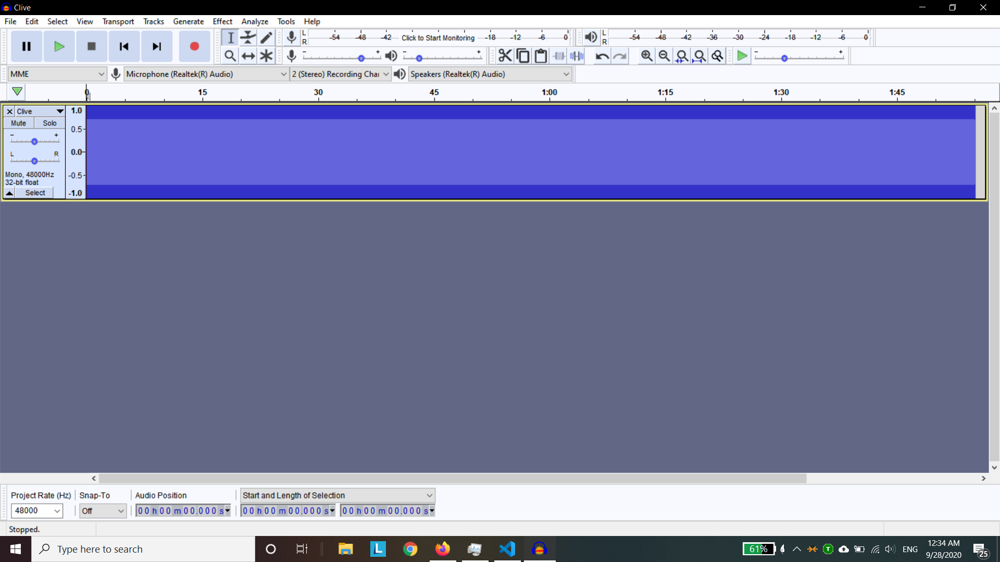
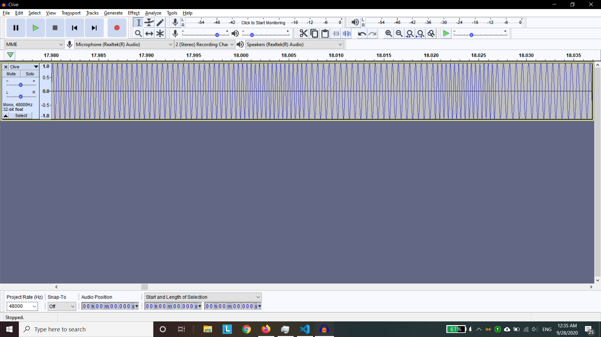
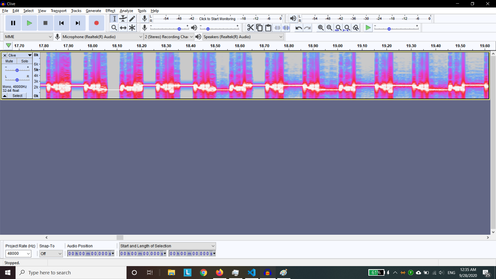
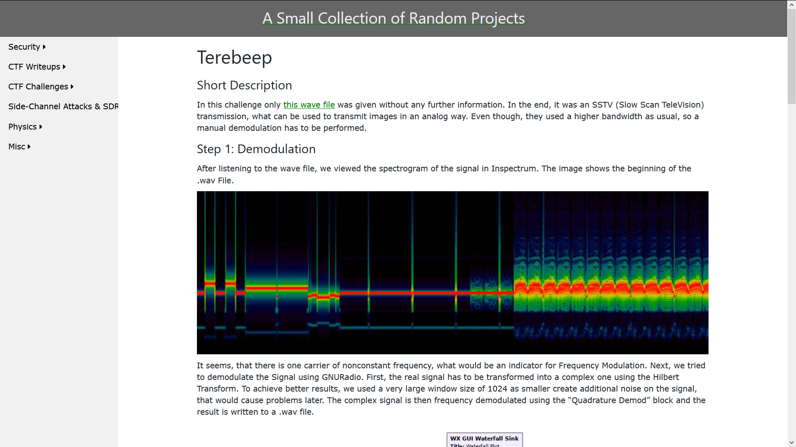
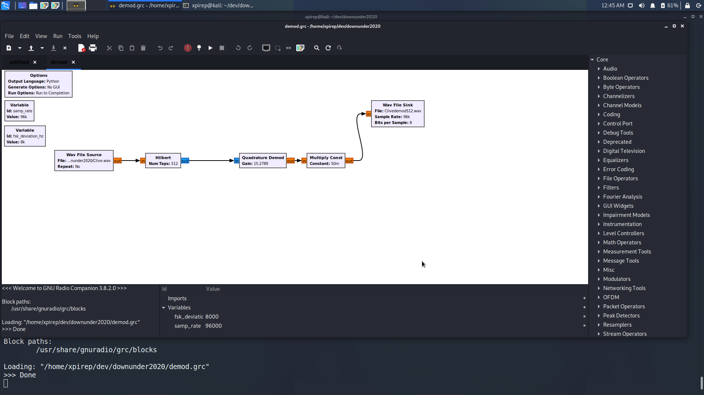
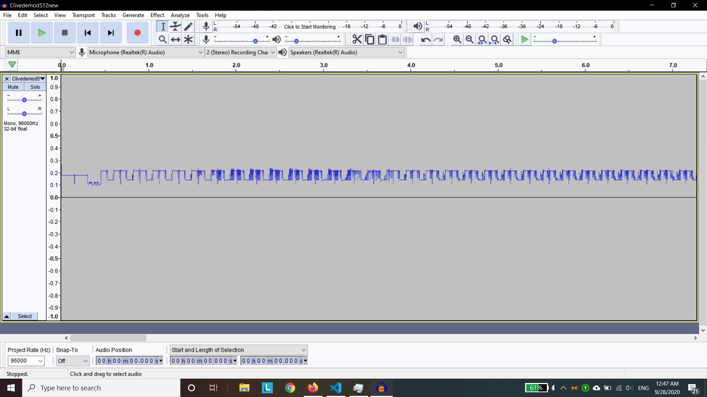
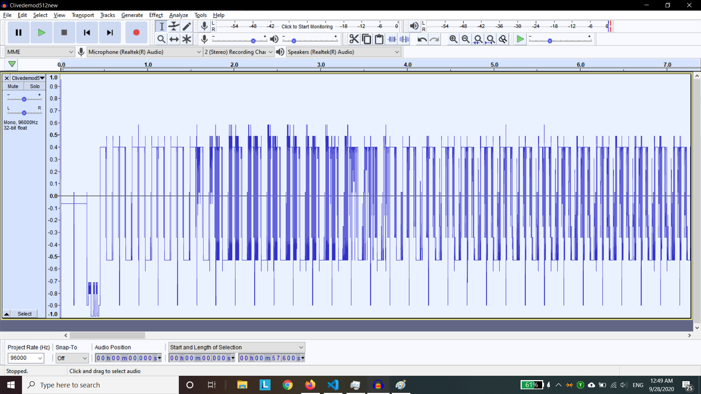
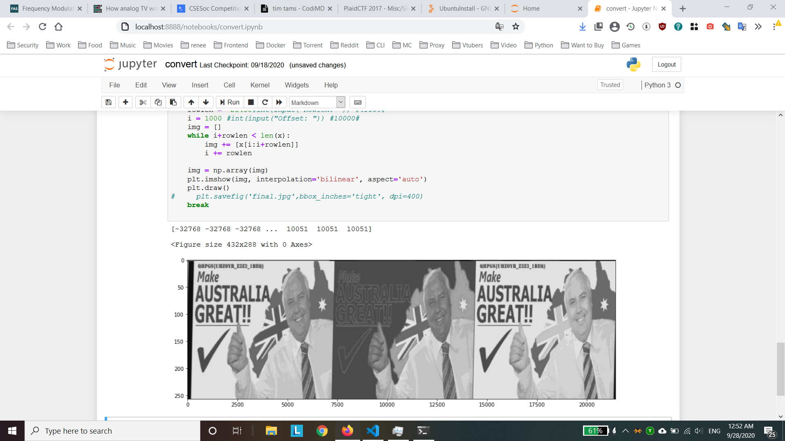
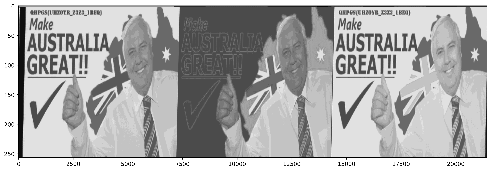

# Clive.wav

points: 273

difficulty: easy

Author: QUT_WH

> When I eat too many Tim Tams, I get rather slow!
> WARNING You will want to turn down your audio for this one!
> Download: https://storage.googleapis.com/files.duc.tf/uploads/Clive.wav

## 1. Recon

- Listened to the audio file
    - it sounds really bad
    - repetitive, with a clear rhythm
    - It sounds like some sort of repetitive data has been encoded into a sound file?
    - wav file, so lossless

What it looked like in audacity:


What it looked like zoomed in:

- same amplitude
- **frequency** is changing

Here is a spectrogram for fun:

- highlights the repetitive nature

After a lot of google searches later, I found this blog:
https://bolek42.github.io/ctf/2017-PlaidCTF/terebeep/README.html




## 2. Implementation



I used the software (GNUradio) from the blog above, and demodulated the audio file after playing around with the values. Eventually I got this:




I stretched it out a bit



And then I ran the following code:

```python
from scipy.io.wavfile import read
import numpy as np
import time

plt.ion()
plt.set_cmap("gray")
plt.figure(figsize=(15,5))
a = read("clive/Clivedemod512neww.wav")
print(a[1])
x = [float(thing) for thing in a[1]]
while True:
# for rl in range(1000,100000,5000):
#     print(rl)
    rowlen =  21430#int(input("Rowlen: ")) #41109#
    i = 1000 #int(input("Offset: ")) #10000#
    img = []
    while i+rowlen < len(x):
        img += [x[i:i+rowlen]]
        i += rowlen

    img = np.array(img)
    plt.imshow(img, interpolation='bilinear', aspect='auto')
    plt.draw()
    plt.savefig('finals.jpg',bbox_inches='tight', dpi=400)
    break
```

This yielded the result:



bigger version



the flag is on the top left, rot13.